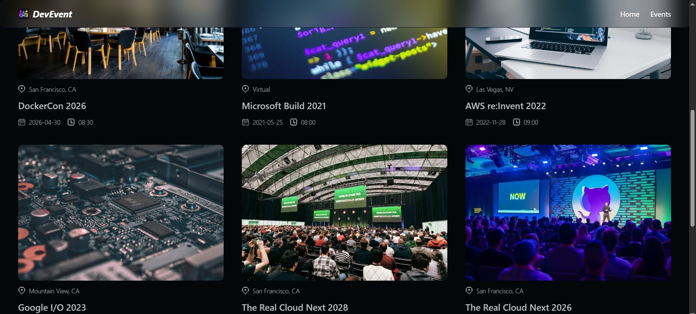
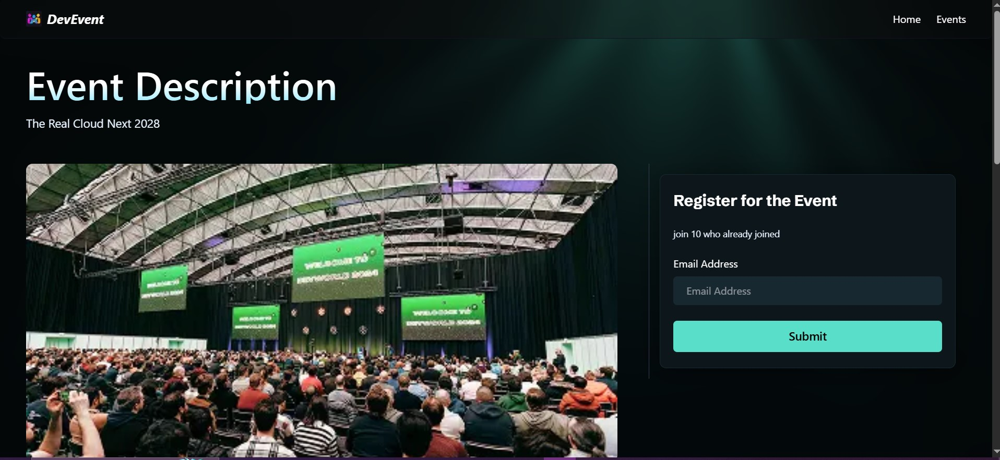
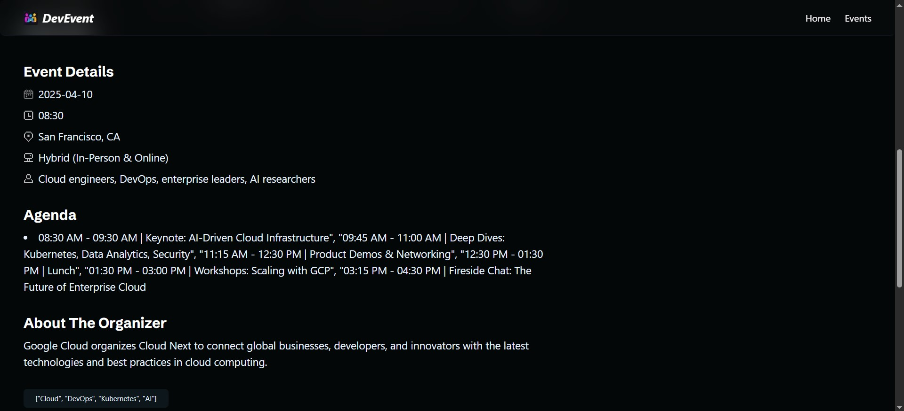
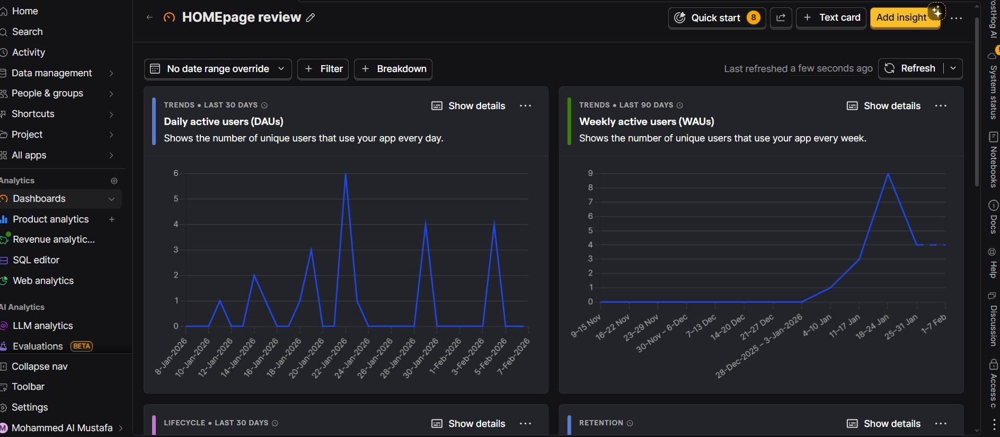

## 🌐 Live Demo

🔗 **Production Deployment:**  
👉 https://devevents-3kyarl86z-mohamed-al-mustafa-kamals-projects.vercel.app/

📌 Dev-Events-NextJs16

Dev-Events-NextJs16 is a modern event management platform built with Next.js 16, TypeScript, MongoDB, and Tailwind CSS. It allows users to explore, register, and engage with events while providing developers with a scalable, high-performance codebase.

## 🌟 Overview

Dev-Events-NextJs16 is designed to:

- Showcase upcoming events dynamically
- Provide CRUD functionality for event management
- Allow image uploads with Cloudinary
- Optimize user experience with Next.js 16 caching
- Track engagement via PostHog analytics
- Emphasize performance, scalability, and reusable code architecture for modern web applications

## ⚡ Features

- **Home Page:** Dynamic list of upcoming and featured events
- **API Routes:** Fully functional endpoints to create, update, delete, and fetch events
- **Cloudinary Integration:** Upload and manage event images efficiently
- **Event Details Page:** Detailed event info, registration, and similar event suggestions
- **Next.js 16 Caching:** Faster page loads and performance optimization
- **PostHog Analytics:** Track user interactions for data-driven improvements
- **Code Reusability:** Modular components and clean architecture

## 🛠 Technologies

| Layer                | Technology                                   |
| -------------------- | -------------------------------------------- |
| Frontend Framework   | Next.js 16 (App Router)                      |
| UI Components        | shadcn/ui                                    |
| Styling              | Tailwind CSS v4                              |
| Database             | MongoDB + Mongoose                           |
| Media Management     | Cloudinary                                   |
| Analytics            | PostHog                                      |
| Programming Language | TypeScript                                   |
| Terminal / Dev Tools | Warp Terminal                                |
| Development Workflow | CodeRabbit (AI-powered scaffolding & coding) |

## 🖼 Screenshots

### Home Page

<p align="center">
	
	
</p>

### Event Details Page

<p align="center">
	
	
</p>

### Admin Management

<p align="center">
	
</p>

## 📂 Project Structure

```
next-js-crash-course/
├── app/
│   ├── api/
│   │   └── events/
│   │       ├── route.ts
│   │       └── [slug]/
│   │           └── route.ts
│   ├── events/
│   │   └── [slug]/
│   │       └── page.tsx
│   ├── globals.css
│   ├── globals.d.ts
│   ├── layout.tsx
│   ├── page.tsx
│   └── posthog-provider.tsx
├── assets/
│   └── screenshots/
│       ├── home1.jpg
│       ├── home2.jpg
│       ├── event-page1.jpg
│       ├── event-page2.jpg
│       └── DashBoard1.jpg
├── components/
│   ├── BookEvent.tsx
│   ├── EventCard.tsx
│   ├── EventDetails.tsx
│   ├── ExploreBtn.tsx
│   ├── LightRays.tsx
│   └── NavBar.tsx
├── database/
│   ├── booking.model.ts
│   ├── event.model.ts
│   └── index.ts
├── lib/
│   ├── constants.ts
│   ├── mongodb.ts
│   ├── utils.ts
│   └── actions/
│       ├── booking.action.ts
│       └── event.actions.ts
├── public/
│   ├── icons/
│   └── images/
├── ...config and root files
```

## 📊 Analytics

PostHog is integrated to track:

- User interactions with events
- Registration funnel metrics
- Feature usage patterns

---

## 👨‍💻 Author

**Mohammed Almustafa Kamal**  
Frontend Engineer
